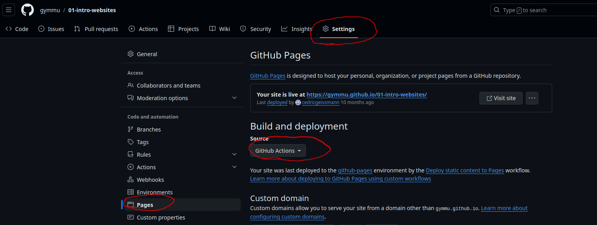

# Erste eigene Webseite

In diesem Projekt bauen wir unsere erste eigene Webseite mit `HTML` und `CSS`.
Die Webseite wird dann über Github-Pages automatisch veröffentlicht, und kann
mit Freunden und Familie geteilt werden. Damit Github-Pages auch funktioniert,
muss es zuerst aktiviert werden. Gehen Sie dafür auf Ihr Repository und dort
finden Sie unter `Settings > Pages` den Abschnitt `Build and Deployments` wo sie
die `Source` auf `Github Actions` umstellen müssen.



Jedes mal wenn Sie eine neue Version auf dem `main`-Branch hochladen, wird die
Webseite neu gebaut. Das kann jeweils ein paar Minuten dauern, ist dann aber
auch für andere über das Internet zugänglich. Um die eigene Webseite direkt zu
sehen, gibt es eine schnellere Lösung, mehr dazu im Abschnitt
[Entwicklungsumgebung aktivieren](#entwicklungsumgebung-aktivieren).

Damit auf der Webseite alles richtig dargestellt werden kann, muss die Datei
`vite.config.js` leicht angepasst werden. Der Wert für `base` muss so angepasst
werden, das der Name des Repositories darin steht.

## Entwicklungsumgebung aktivieren

Damit wir eine Webseite korrekt anzeigen lassen können, und alle Bilder laden
können die dazu gehören, brauchen wir einen Webserver. Diesen können wir im
Container ganz einfach starten. Und zwar können wir ein Terminal öffnen, wenn
dies nicht bereits geöffnet wurde, und dort müssen wir nur noch den folgenden
Befehl eingeben.

```bash
npm run start
```

Das startet und einen Webserver, über den wir unsere Seite dann anschauen
können. Wir können die Seite automatisch im Editor anzeigen lassen, oder Sie auf
einem separaten Browser öffnen. Dafür einfach die folgende URL öffnen:
[http://localhost:5174](http://localhost:5174). Nun sollten alle Änderungen die
wir im Code machen und **speichern** (`CRTL + S`) direkt auf der Webseite
ersichtlich sein. Manchmal muss die Webseite auch neu geladen werden, dazu kann
man bei den meisten Browsern `F5` drücken.

## Aufgaben

Wenn alles aufgesetzt ist, können Sie die folgenden Aufgaben bearbeiten, um
einen guten Einstieg ins Projekt zu bekommen.

### Aufgabe: Titel hinzufügen

Fügen Sie in der Datei `index.html` ein `<h1>`-Tag ein, mit dem Titel
`'Meine erste Webseite'` ein.
