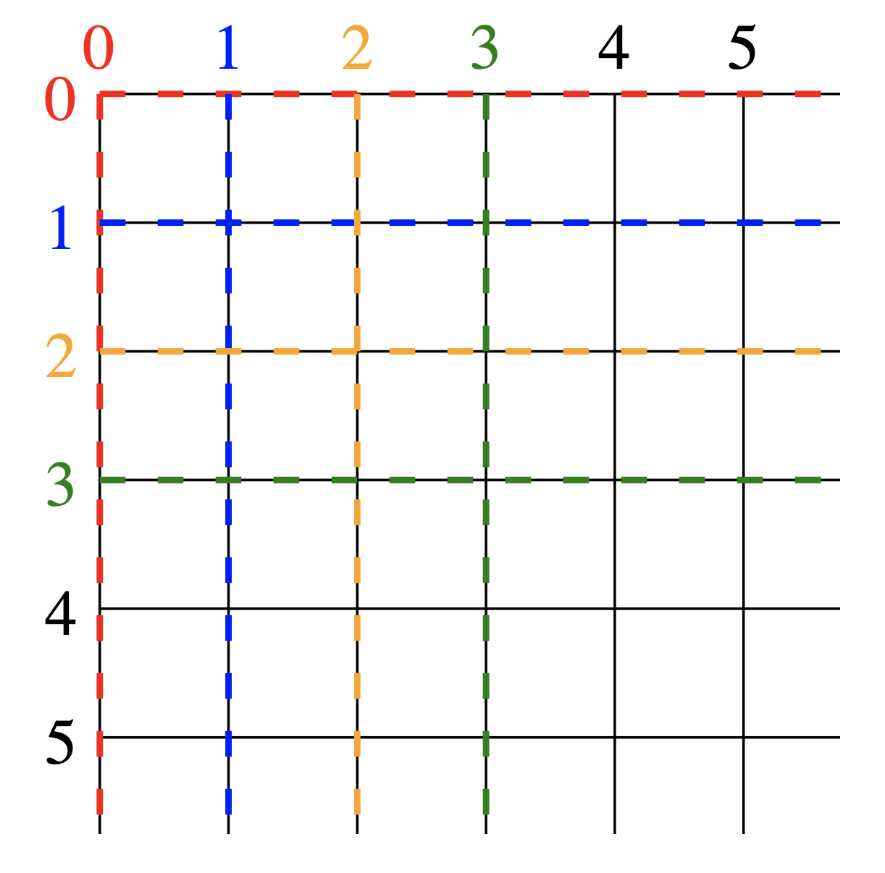

# Grafiken mit SVG erstellen

In diesem Projekt erweitern wir unsere erste eigene Webseite mit `SVG`-Grafiken.
Die Webseite wird dann über Github-Pages automatisch veröffentlicht, und kann
mit Freunden und Familie geteilt werden. Damit Github-Pages auch funktioniert,
muss es zuerst aktiviert werden. Gehen Sie dafür auf Ihr Repository und dort
finden Sie unter `Settings > Pages` den Abschnitt `Build and Deployments` wo sie
die `Source` auf `Github Actions` umstellen müssen.


Jedes mal wenn Sie eine neue Version auf dem `main`-Branch hochladen, wird die
Webseite neu gebaut. Das kann jeweils ein paar Minuten dauern, ist dann aber
auch für andere über das Internet zugänglich. Um die eigene Webseite direkt zu
sehen, gibt es eine schnellere Lösung, mehr dazu im Abschnitt
[Entwicklungsumgebung aktivieren](#entwicklungsumgebung-aktivieren).

Damit auf der Webseite alles richtig dargestellt werden kann, muss die Datei
`vite.config.js` leicht angepasst werden. Der Wert für `base` muss so angepasst
werden, das der Name des Repositories darin steht.

## Entwicklungsumgebung aktivieren

Damit wir eine Webseite korrekt anzeigen lassen können, und alle Bilder laden
können die dazu gehören, brauchen wir einen Webserver. Diesen können wir im
Container ganz einfach starten. Und zwar können wir ein Terminal öffnen, wenn
dies nicht bereits geöffnet wurde, und dort müssen wir nur noch den folgenden
Befehl eingeben.

```bash
npm run dev
```

Das startet und einen Webserver, über den wir unsere Seite dann anschauen
können. Wir können die Seite automatisch im Editor anzeigen lassen, oder Sie auf
einem separaten Browser öffnen. Dafür einfach die folgende URL öffnen:
[http://localhost:5174](http://localhost:5174). Nun sollten alle Änderungen die
wir im Code machen und **speichern** (`CRTL + S`) direkt auf der Webseite
ersichtlich sein. Manchmal muss die Webseite auch neu geladen werden, dazu kann
man bei den meisten Browsern `F5` drücken.

## SVG

Die Abkürzung SVG stheht für **_Scalable Vector Graphics_**.
Die meisten Bilder und Grafiken, die Sie verwenden und online finden, basieren auf Pixeln. Der Nachteil dieser Rastergrafiken ist, dass sie sich nicht gut skalieren lassen - das heisst, wenn Sie ausreichend heranzoomen, werden Sie irgendwann immer die einzelnen Pixel sehen.

Vektorgrafiken basieren auf einer völlig anderen Idee: Anstatt dem Computer zu sagen, welche Pixel ein- und ausgeschaltet werden sollen, geben wir dem Computer vor, welche Form wir möchten, und er füllt die Pixel bei Bedarf aus.
Das bedeutet, dass der Computer immer weiss, wie das Bild aussehen sollte, unabhängig davon, wie stark wir heran- oder herauszoomen, und es mit der entsprechenden Auflösung zeichnen kann.
Ein weiterer Vorteil von SVG ist, dass SVG-Dateien oft kleiner als vergleichbare Rastergrafiken sind, insbesondere bei komplexen und detaillierten Bildern.
Zudem unterstützt SVG interaktive Elemente und Animationen, die direkt in die Grafik eingebettet werden können.

### Tags und Attribute

**_Tags_** sind die grundlegenden Bausteine in SVG-Grafiken (wie auch in HTML) , die die Struktur und den Inhalt einer Datei definieren. Tags werden durch öffnende (`<>`) und schliessende(`</>`) Winkelklammern markiert und haben einem Namen, der den Typ des Elements spezifiziert.

> **Beispiel:**
>
> ```svg
> <svg width="100" height="100">
>    <!-- Weitere SVG-Elemente -->
> </svg>
> ```

`<svg>` ist das Wurzelelement, das die gesamte SVG-Grafik umschliesst.

**_Attribute_** sind zusätzliche Informationen, die innerhalb eines Tags spezifiziert werden, um die Eigenschaften des Elements zu definieren. Jedes Attribut besteht aus einem Namen und einem Wert, die durch ein Gleichheitszeichen (`=`) verbunden und in Anführungszeichen gesetzt sind.

> **Beispiel:**
>
> ```svg
> <svg width="100" height="100">
> ```

`width="100"` und `height="100"` sind zwei Attribute mit zugehörigem Wert, welche die Grösse der SVG-Grafik beeinflussen.

### Koordinatensystem

Wenn Sie mit SVG arbeiten, so orientieren Sie sich stets an einem Koordinatensystem:


Wie Sie sehen, befindet sich der Koordinatenursprung `(0,0)` in der oberen linken Ecke. Von dort aus können die positiven x-Koordinaten nach rechts und die positiven y-Koordinaten nach unten abgelesen werden.

Die Grösse des Koordinatensystems können Sie über folgende zwei Attribute im `<svg>`-Tag festlegen:

-   `width`: wird verwendet, um die Breite des Koordinatensystems festzulegen.
-   `height`: wird verwendet, um die Höhe des Koordinatensystems festzulegen.

Bei den zu lösenden Aufgaben werden Sie im normalfall mit folgenden Attributwerten arbeiten:

```svg
<svg width="500" height="500">
```

### Formen (Kreis und Rechteck)

Das `<circle>`-Element zeichnet einen **_Kreis_** auf dem Bildschirm. Es verwendet drei grundlegende Attribute, um Form und Grösse des Elements zu bestimmen:

-   `r`: Der Radius des Kreises.
-   `cx`: Die x-Position des Zentrums des Kreises.
-   `cy`: Die y-Position des Zentrums des Kreises.

Zusätzlich dazu gibt es noch eine Reihe von anderen Attributen, die festgelegt werden können. Diese Attribute können für jede SVG-Form festgelegt werden.

-   `fill`: Die Füllfarbe.
-   `stroke`: Die Strichfarbe.
-   `stroke-width`: Die Strichbreite.
-   `opacity`: Die Deckkraft der Form.

Beispiel:

```svg
<svg width="500" height="500">
    <circle
        cx="250"
        cy="250"
        r="100"
        stroke="green"
        stroke-width="10"
        fill="yellow"
        opacity="0.5"
    />
</svg>
```

Das `<rect>`-Element zeichnet ein **_Rechteck_** auf dem Bildschirm. Es gibt 6 grundlegende Attribute, die die Position und Form der Rechtecke auf dem Bildschirm steuern.

-   `x`: Die x-Position der oberen linken Ecke.
-   `y`: Die y-Position der oberen linken Ecke.
-   `width`: Die Breite des Rechtecks. height Die Höhe des Rechtecks.
-   `rx`: Der x-Radius für abgerundete Ecken (wenn nicht festgelegt, wird er auf 0 gesetzt).
-   `ry`: Der y-Radius für abgerundete Ecken (wenn nicht festgelegt, wird er auf 0 gesetzt).

Beispiel:

```svg
<svg width="500" height="500">
    <rect
        x="100"
        y="100"
        width="100"
        height="50"
        fill="blue"
        stroke="red"
        opacity="0.5"
        stroke-width="5px"
    />
</svg>
```

### Elemente definieren und verwenden (defs, use)

Das `<defs>`-Tag (definitions) wird in SVG verwendet, um Elemente zu erstellen und zu speichern. Danach können diese wieder verwendet werden.
Elemente innerhalb eines <defs>-Tags werden nicht direkt angezeigt, sondern müssen von anderen Elementen im SVG-Dokument mithilfe des `<use>`-Tags und einer `id` aufgerufen werden.

Beispiel:

```svg
<svg width="500" height="500">
    <defs>
        <circle id="smallCircle" cx="250" cy="250" r="50" />
        <circle id="bigCircle" cx="250" cy="250" r="200" />
    </defs>
    <use href="#bigCircle" fill="blue" />
    <use href="#smallCircle" fill="red" />
</svg>
```

Bei der Verwendung des `<use>`-Tags können noch zusätzliche Attribute wie Füllfarbe, Positionierung (`x=" "` und `y=" "`) oder Grösse ergäntz werden.

### Ausschneiden (clipPath)

Das `<clipPath>`-Element definiert einen Pfad.
Ein Element, das innerhalb eines Clipping-Pfads liegt, wird angezeigt, während alles ausserhalb des Pfads ausgeblendet wird.

Beispiel:

```svg
<svg width="500" height="500">
    <defs>
        <clipPath id="myClip">
            <circle cx="250" cy="250" r="100" />
        </clipPath>
    </defs>
    <rect
        x="150"
        y="200"
        width="200"
        height="100"
        fill="blue"
        clip-path="url(#myClip)"
    />
</svg>
```

### Weitere Formen (Ellipse, Polygon)

Ein `<ellipse>`-Element ist eine allgemeinere Form des `<circle>`-Elements, bei dem Sie den `x`- und `y`-Radius (in der Mathematik oft als Halbachsen bezeichnet) des Kreises separat skalieren können.

-   `rx`: Der `x`-Radius des Kreises.
-   `ry`: Der `y`-Radius des Kreises.
-   `cx`: Die `x`-Position des Zentrums des Kreises.
-   `cy`: Die `y`-Position des Zentrums des Kreises.

Beispiel:

```svg
<svg width="500" height="500">
    <ellipse cx="250" cy="250" rx="20" ry="50" fill="purple" />
</svg>
```

Ein `<polygon>`-Element besteht aus geraden Liniensegmenten, die eine Liste von Punkten verbinden. Jeder Punkt muss zwei Zahlen enthalten: eine x-Koordinate und eine y-Koordinate. Die Liste `(0,0)`, `(1,1)` und `(2,2)` könnte also als `0, 0 1, 1 2, 2` geschrieben werden. Sie können auch jeden Punkt für bessere Lesbarkeit auf einer neuen Zeile schreiben, wie unten abgebildet.
Bei Polygonen verbindet der Pfad automatisch den letzten Punkt mit dem ersten, um eine geschlossene Form zu erstellen.

Beispiel:

```svg
<svg width="500" height="500">
    <polygon
        points=" 
        300, 250
        220, 100
        150, 250 
        "
        fill="lime"
        stroke="purple"
        stroke-width="1"
    />
</svg>
```

### Gruppen (g)

Das `<g>`-Element ist ein Gruppierungselement, das verwendet wird, um mehrere SVG-Elemente zusammenzufassen. Dadurch können Sie Transformationen, Stile oder andere Attribute auf eine Sammlung von SVG-Elementen als Einheit anwenden.

Beispiel:

```svg
<svg viewBox="500 500">
    <g fill="white" stroke="green" stroke-width="5">
        <circle cx="100" cy="0" r="50" />
        <rect x="50" y="50" width="100" height="100" opacity="0.5" />
    </g>
</svg>
```

Ein Vorteil von Gruppen ist, dass man sie wiederverwenden kann. Dies ist
beispielsweise über eine `id` und das Ihnen bereits bekannte `<use>`-Tag möglich.

Beispiel:

```svg
<svg viewBox="500 500">
    <g id="myGroup" fill="white" stroke="green" stroke-width="5">
        <circle cx="100" cy="0" r="50" />
        <rect x="50" y="50" width="100" height="100" opacity="0.5" />
    </g>
    <use href="#myGroup" y="100" />
</svg>
```

Wenn wir ein Element mit `<use>` wieder verwenden möchten, und es neu platzieren
oder rotieren möchten. Dann können wir das Attribut `transform` verwenden. Hier
ist wichtig das wir die Reihenfolge der Operationen in `transform` beachten. Am
besten zuerst verschieben und dann rotieren.

Beispiel:

```svg
<svg width="500" height="500">
    <defs>
        <g id="toll" fill="white" stroke="green" stroke-width="5">
            <circle cx="50" cy="50" r="50" />
            <rect x="100" y="0" width="100" height="100" opacity="0.5" />
        </g>
    </defs>
    <use href="#toll" transform="translate(250 250) rotate(90)" />
</svg>
```

### Pfade

Ein Pfad ist die allgemeinste Form, die in SVG verwendet werden kann. Mit einem `<path>`-Element können Sie Rechtecke (mit oder ohne abgerundete Ecken), Kreise, Ellipsen, Polylinien und Polygone zeichnen.
Grundsätzlich können Sie damit jede andere Art von Formen, Bézierkurven (parametrisch modellierte Kurve), quadratische Kurven und vieles mehr erstellen.

Ein Pfad ist durch ein einzelnes Attribut definiert:

-   `d`: Eine Liste von Punkten und anderen Informationen darüber, wie der Pfad gezeichnet werden soll.

Um den Pfad festzulegen, kann man neben den Koordinaten noch weitere Befehle verwenden:

-   `M`: moveto (Bewegung von einem Punkt zum Anderen)
-   `L`: lineto (Erstellt eine Linie)
-   `Q`: quadratic Bézier curve (Erstellt eine quadratische Bézierkurve)
-   `Z`: closepath (Schliesst den Pfad)

Beispiel:

```svg
<svg width="500" height="500">
    <path
        d="M 150 250 Q 250 150  350 250 L 250 100 Z"
        stroke="green"
        fill="none"
        stroke-width="5"
    />
</svg>
```

Sind die Befehle in Grossbuchstaben geschrieben (wie oben), so müssen die Koordinaten wie im verwendeten Koordinatensystem angegeben werden.
Wenn die Befehle mit Kleinbuchstaben geschrieben werden, so werden die Koordinaten relativ interpretiert. Das heisst, dass in Abhängigkeit vom zuletzt verwendeten Standpunkt weiter gezeichnet wird.

Beispiel absolut:

```svg
<svg width="500" height="500">
    <path
        d="M 150 250 L 350 250 L 250 100 Z"
        stroke="green"
        fill="none"
        stroke-width="5"
    />
</svg>
```

Beispiel relativ:

```svg
<svg width="500" height="500">
    <path
        d="M 150 250 l 200 0 l -100 -100 z"
        stroke="green"
        fill="none"
        stroke-width="5"
    />
</svg>
```

### Animationen

In SVG gibt es zwei Arten von Animationen. Eine Art der Animation ist es einen
Wert bzw. ein Attribut zu verändern. Die andere Art der Animation, ist ein
Element einem Pfad folgen zu lassen.

Beispiel Attrubut verändern:

```svg
<svg width="500" height="500">
    <ellipse cx="250" cy="250" rx="50" ry="50" fill="green">
        <animate
            attributeName="cy"
            values="50;5;50"
            repeatCount="indefinite"
            dur="2s"
        />
    </ellipse>
</svg>
```

Beispiel entlang einem Pfad bewegen:

```svg
<svg width="500" height="500">
    <path
        d="M 100 250 L 400 250 Z"
        id="follow-this"
        stroke="black"
        stroke-width="5"
    />
    <rect fill="pink" height="20" transform="translate(-40 -10)" width="80">
        <animateMotion dur="2s" repeatCount="indefinite">
            <mpath href="#follow-this" />
        </animateMotion>
    </rect>
</svg>
```

## Aufgaben

Wenn alles aufgesetzt ist, können Sie die folgenden Aufgaben bearbeiten, um
einen guten Einstieg ins Projekt zu bekommen.
Arbeiten Sie mit einem `500x500` grossen Koordinatensystem, wenn nicht anders
verlangt.

> **Wichtig:** Machen Sie spätestens nach jeder Aufgabe einen Commit, damit die
> Arbeit versioniert ist. Besser noch, machen Sie während einer Aufgabe viele
> kleine sinnvolle Commits.

### Aufgabe 01: Kreis

Zeichenen Sie einen schwarzen Kreis mit Radius 100 genau in der Mitte der
Zeichenfläche. Zeichnen Sie einen zweiten roten Kreis, der 100 Einheiten nach
links verschoben ist.

### Aufgabe 02: Mehrere Kreise

Zeichnen Sie drei Kreise in einer Reihe, die sich berühren und von links nach rechts kleiner werden. Die Kreise sollten alle unterschiedliche Füllfarben haben.

### Aufgabe 03: Kreis und Quadrat

-   Erstellen Sie einen zentrierten Kreis von Radius 50.
    Der Kreis soll einen 10 Pixel breiten roten Rand haben.
-   Zeichnen Sie um Ihren Kreis ein Quadrat, welches den Rand des Kreises berührt.

### Aufgabe 04: Quadrate

Zeichnen Sie ein gelbes Quadrat das zentriert ist. Das Quadrat hat eine
Seitenlänge von 150 Einheiten. Zeichnen Sie ein zweites Quadrat darüber.
Zeichnen Sie von diesem Quadrat nur den Umfang mit einer Dicke von 10 Einheiten,
und rotieren Sie das Quadrat um 45°.

> **Tipp:** Mit `transform=rotate(deg x y)` können Sie angeben um wieviel Grad
> eine Figur um den Punkt `(x, y)` gedreht werden soll.

### Aufgabe 05: Ellipse

-   Nutzen Sie das `<defs>`-Tag, um eine flache Ellipse zu definieren.
-   Schichten Sie drei verschieden farbige Ellipsen übereinander. Diese sollen sich nur berühren, nicht überschneiden.

### Aufgabe 06: clipPath

Erstellen Sie einen `clipPath` mit einem Kreis, der zentriert ist, und einen
Radius von 120 Einheiten hat. Zeichnen Sie dann ein zentriertes, cyan-farbiges
Quadrat, mit einer Seitenlänge von 200 Einheiten. Die Ecken von dem Quadrat
sollen von dem `clipPath` abgeschnitten werden.

### Aufgabe 07: Gruppen

Zeichnen Sie 3 Linien direkt aneinander mit unterschiedlichen Farben. Rotieren
Sie dann die ganze Linie um den Startpunkt der Linie um 30°.

> **Tipp:** Verwenden Sie das Gruppen-Element `<g>` um auf alle Elemente einer
> Gruppe die gleiche Transformation zu machen.

### Aufgabe 08: Pfad absolute Koordinaten

Zeichnen Sie das Haus von Nikolaus mit einem Pfad. Verwenden Sie dafür nur
absolute Koordinaten.

> **Tipp:** Koordinaten in einem Pfad sind absolut, wenn der Befehl mit einem
> Grossbuchstaben geschrieben ist.
>
> ```svg
> <svg width="500" height="500">
>    <path d="M 100 250 L 400 250 Z" stroke="black" stroke-width="5" />
> </svg>
> ```

### Aufgabe 09: Pfad absolute und relative Koordinaten

Zeichnen Sie das Haus von Nikolaus mit relativen Koordinaten.

### Aufgabe 10: Eigene Animation

Erstellen Sie eine eigene Grafik mit Animationen. Verwenden Sie dafür beide
Arten der Animation.

## Arbeit abgeben

Wenn Sie mit allen Aufgaben fertig sind, und alles was Sie gemacht haben zur
Versionskontrolle hinzugefügt haben, dann können Sie den `main`-Branch `pushen`.
Damit haben Sie Ihr Projekt dann abgegeben. Wenn Sie noch mehr Veränderungen
machen möchten, können Sie diese genau gleich hinzufügen und dann `pushen`. Das
wird dann automatisch zur neuen Abgabe.
